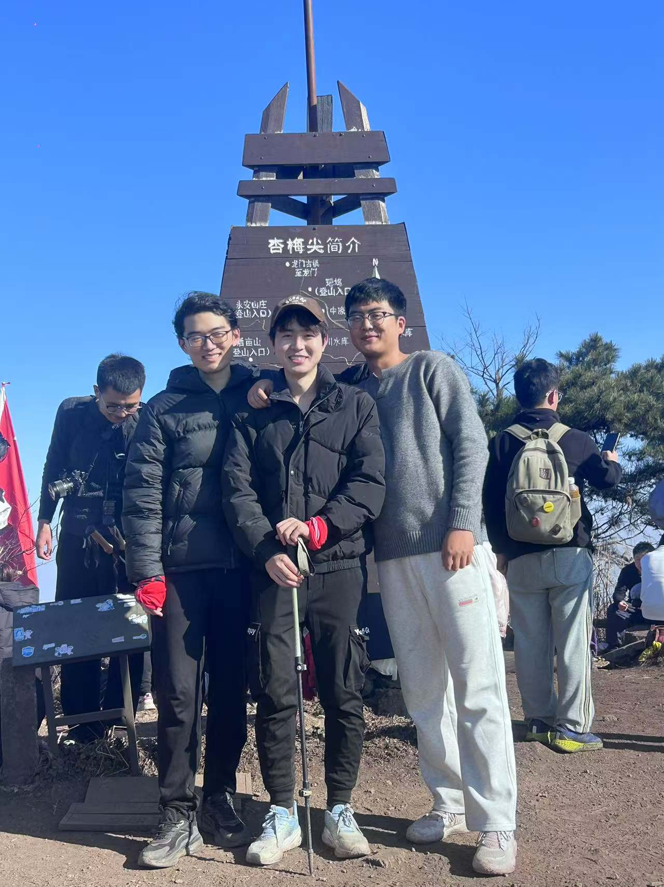

###  Group Dinner  (2025.1.19)

    

        
    

    

        
Year-end party for 2024, and wish all of us healthy and fruitful achievements in 2025.

    

### Team Building at Xingmeijian Peak on New Year's Day (2025.1.1)

    

        
As the new year dawned, three graduate students, Xia Yun, Liu Bo, and Chen Chuhao, embarked on a journey to conquer 
         Xingmeijian Peak in Fuyang District, Hangzhou. Amidst the rigorous academic pursuits, they managed to find time to fully unwind and 
          rejuvenate their spirits. Furthermore, each of them harbored aspirations to advance in their studies, much like scaling a mountain, 
           rising steadily and continuously!

    

    

        
    

### The second "Beautiful China" Innovation Design Competition for Chinese graduate students (2024.9.22)

    

        
Dr. Xue led us to participate in the second "Beautiful China" Innovation Design Competition of Chinese graduate students, and the team atmosphere was harmonious.

    

    

        
    

### JCRAI (2024.9.14)

    
  <!-- 修改为左对齐 -->
        
    

    

        
We participated in the JCRAI, where Dr. Xue is one of the special section chairs, and Yun Learnt a lot from it.

    

### GECC (2022.11.12)

    

        
We participated in the Global Edge Computing Conference, where Yun's dream began.

    

    

        
    

<!-- ---
title: album
---

# Image Gallery

    
    

        ## Image 1 Title
        This is the description for Image 1. Here you can provide more background information or related content.
    

---

    
    

        ## Image 2 Title
        This is the description for Image 2. You can also add some interesting facts or related information here.
    

---

    
    

        ## Image 3 Title
        This is the description for Image 3. You can add more details here, or describe the importance of this image.
    

---
 -->
